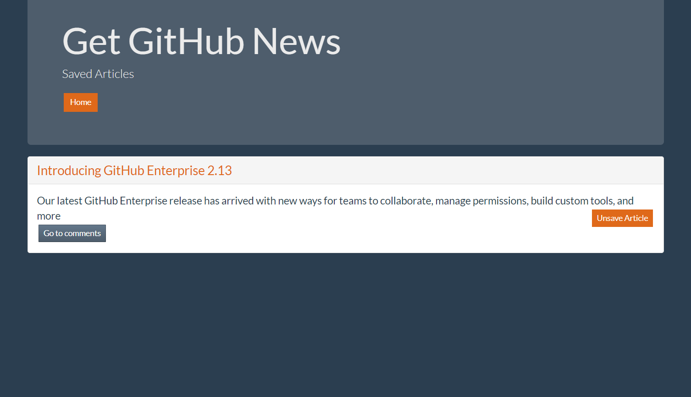
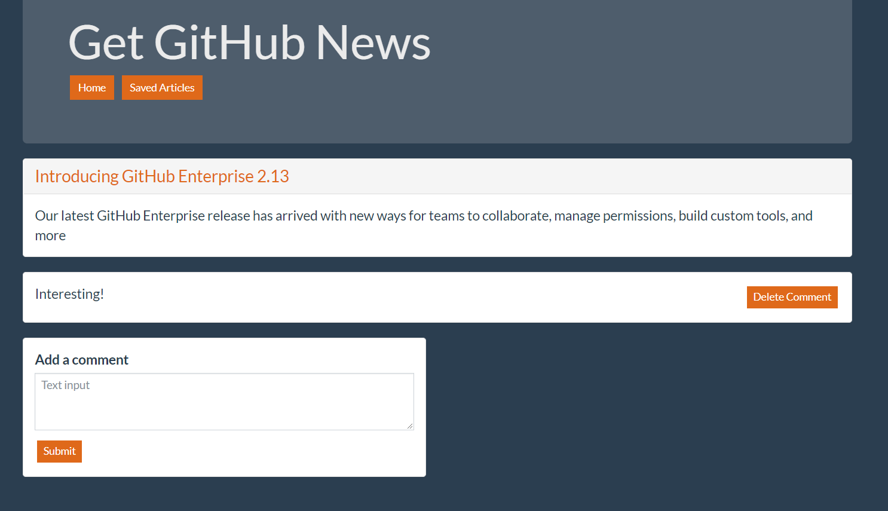

# GitHub News Scraper

## This app scrapes articles from GitHub's blog, and allows users to save and unsave articles, as well as create and delete comments associated with each article. It is built using Express, scrapes with Cheerio, stores and retrieves data with Mongo and Mongoose, and renders article information with Handlebars.

### The app displays recent articles scraped from GitHub's blog

### Articles can be saved and viewed in the Saved Articles page

### Comments can be added to and deleted from each article

